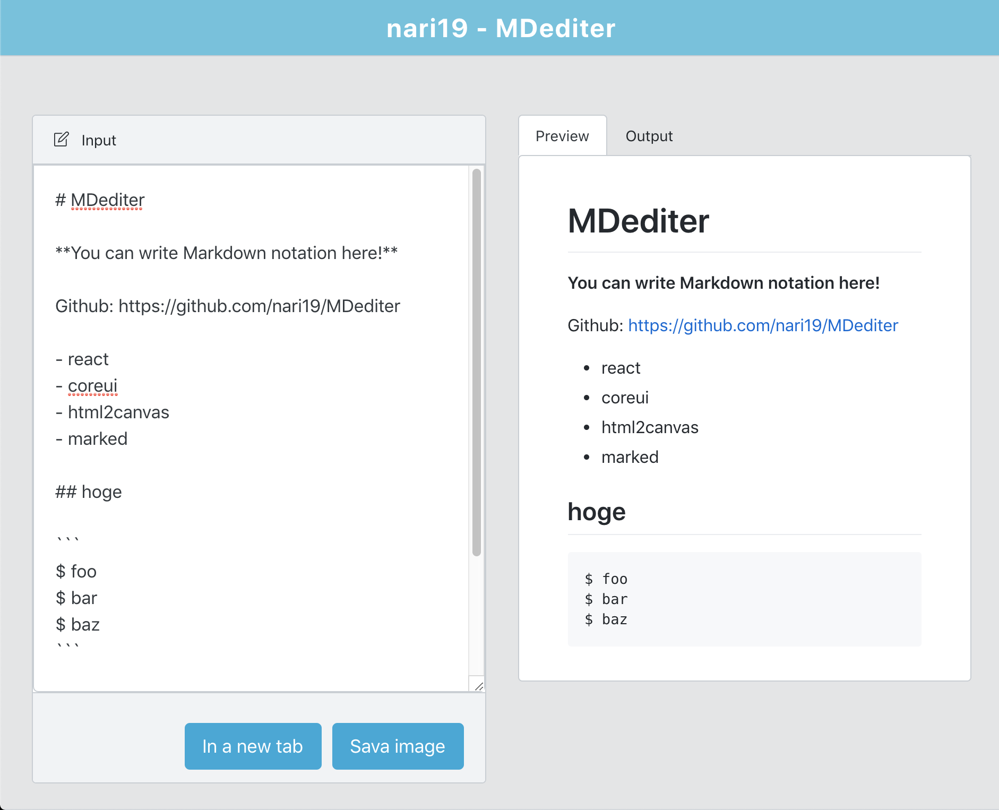

# nari19-MDediter



url: https://mdediter.nari19.me/


## 参考URL

- [CoreUI GitHub](https://github.com/coreui/coreui-free-react-admin-template)
- [CoreUI for React 公式ページ](https://coreui.io/react/)
- [Live preview](https://coreui.io/react/demo/#/dashboard)


## Command

```
$ npm start
$ npm run build
$ serve -s build

$ npm run deploy   // リモートのgh-pagesブランチにデプロイ(デプロイ毎にカスタムドメインの設定がリセットされることに注意)
```

## What's included
```
CoreUI-React#v2.0.0
├── public/          #static files
│   ├── assets/      #assets
│   └── index.html   #html temlpate
│
├── src/             #project root
│   ├── containers/  #container source
│   ├── scss/        #user scss/css source
│   ├── views/       #views source
│   ├── App.js
│   ├── App.test.js
│   ├── index.js
│   ├── _nav.js      #sidebar config
│   └── routes.js    #routes config
│
└── package.json
```